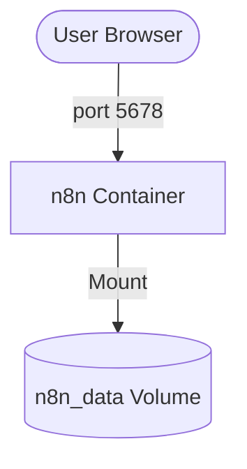

# 設計書

## アーキテクチャ概要

単一のコンテナサービス（n8n）を Docker Compose で管理する。



## コンポーネント設計

### 1. n8n サービス

**責務**:

- n8n アプリケーションの実行。
- ワークフローの実行と管理。

**実装の要点**:

- イメージ: `docker.n8n.io/n8nio/n8n:latest` を使用。
- ポートマッピング: ホストの `5678` をコンテナの `5678` にマップ。
- ボリューム: 既存の `n8n_data` ボリュームを `external` として定義し、`/home/node/.n8n` にマウント。

## データフロー

### 起動シーケンス

```
1. ユーザーが docker compose up -d を実行
2. Docker Compose が n8n_data ボリュームの存在を確認
3. n8n コンテナが起動し、ボリュームをマウント
4. n8n サービスがポート 5678 でリッスン開始
```

## テスト戦略

### 動作確認

- コンテナ起動ログの確認 (`docker compose logs -f`)。
- ブラウザからのアクセス確認。
- コンテナ再起動後の設定保持確認。

## ディレクトリ構造

```
/Users/y_yoshida/Projects/my-n8n/
├── docker-compose.yml
├── .gitignore
└── README.md
```

## 実装の順序

1. `.gitignore` の作成。
2. `docker-compose.yml` の作成。
3. 動作確認。
4. `README.md` の更新。

## セキュリティ考慮事項

- 将来的に環境変数に認証情報を入れる場合は、`.env` ファイルを使用し、Git 管理から外すこと。
